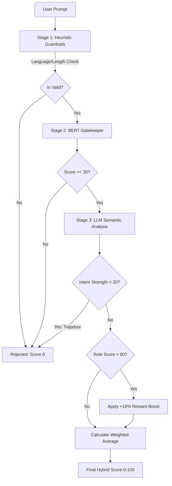

# Prompt Analyzer: A Hybrid Ensemble Approach

An Empirical Prompt Evaluation Process that is based on a Hybrid Ensemble of Machine Learning Approaches 
### [](https://prompt-analyzer-omega.vercel.app/)

## 1. Introduction
As large Language Models (LLMs), the industry has transitioned from explicit to ‘Prompt Engineering’ and thus has an increasing need for objective evaluation metrics. Although the quality of the input provided to LLMs is critically important, existing methods of evaluating prompts are mostly based on the subjective assumptions of users. The Prompt Analyzer provides an automated and empirical scoring on a 100 point scale to evaluate the prompt's efficiency. 

---

## 2. Key Features
* **Empirical Scoring**: Provides a consistent numerical rating between 0-100 through a weighted fusion of structural (BERT) and semantic (LLM) analyses.
* **Resource Optimization**: Employs a lightweight BERT model as a "Gatekeeper" to reject low-quality inputs before they reach expensive LLM APIs.
* **Intent Verification**: Uses a probabilistic classifier to identify and remove non-instructional texts, such as poems or stories, from the scoring pipeline.
* **Data Balancing**: Mitigates "Mode Collapse" (the "Tower of 65" problem) through data up-sampling, ensuring high and low-quality prompts are detected accurately.
* **Live Demo**: https://prompt-analyzer-omega.vercel.app/

---

## 3. System Architecture & Methodology
The system utilizes a "Defense-in-Depth" architecture, decoupling structural analysis from semantic reasoning to optimize computational efficiency.
### Architecture Flow


### The Multi-Stage Pipeline
The system implements a "Defense-in-Depth" strategy to ensure high quality and relevance while optimizing computational costs.


#### 1. Stage 1: Heuristic Guardrails (Pre-Processing)
This layer performs instant sanitation before any API calls are triggered.
* **Language Detection**: Uses `langdetect` to reject any non-English text, preventing "Lorem Ipsum" or junk inputs.
* **Sanity Checks**: Rejects prompts that are too short (< 3 words) or consist of repetitive spam patterns.

#### 2. Stage 2: Structural Scoring (The BERT Gatekeeper)
A fine-tuned **BERT regressor** evaluates the technical structure, grammar, and token distribution.
* **Resource Optimization**: If the Technical Score is **< 30**, the prompt is rejected immediately as "incoherent gibberish" to save expensive GPU cycles.
* **Service**: Hosted as a containerized Docker service via Hugging Face Spaces for low-latency inference.

#### 3. Stage 3: Semantic Scoring & Intent Verification (Cloud LLM)
High-quality inputs that pass the Gatekeeper reach the LLM model for deep analysis.
* **Probabilistic Intent Classifier**: Quantifies Intent Strength (0-100) to distinguish between actionable instructions and non-instructional content like poems or speeches.
* **6-Point Rubric**: Evaluates prompts based on Clarity, Specificity, Contextual Priming, Constraint Adherence, Reasoning Complexity, and Goal Alignment.
* **Logic Trapdoor**: If the Intent Score is **< 20**, all scores are overridden to 0, and the status is set to REJECTED to prevent "hallucinated" quality scores for unrelated text.
---
## 4. Mathematical Logic

### Calibration Formula
Raw outputs from the BERT regressor are often conservative. We apply linear scaling to map the effective range to a human-readable 0-100 scale:
* $$Final Score = (Raw Score - 30) \times 3.33$$

### Hybrid Weighting Strategy
To solve the "Intent vs. Content" dichotomy, the system evolved from rewarding fluency to rewarding utility:
* **The Grammar Trap**: $65\%$ BERT / $35\%$ LLM. This incorrectly gave high scores to "pretty" text like poems.
* **The Intent Shift**: $30\%$ BERT / $70\%$ LLM. This prioritizes meaning and utility over linguistic fluency.

---

## 5. Technical Implementation & Setup

### Tech Stack
* **Machine Learning**: Hugging Face Transformers (BERT), PyTorch, LangChain.
* **Backend**: FastAPI for microservices and Flask for orchestration.
* **Deployment**: Vercel (Serverless Functions) and Hugging Face Inference API.

### Installation & Local Setup
1.  **Clone the Repository**:
    ```bash
    git clone [https://github.com/genaivitbcommunity/prompt_analyzer.git](https://github.com/genaivitbcommunity/prompt_analyzer.git)
    cd prompt_analyzer
    ```
2.  **Install Dependencies**:
    ```bash
    pip install -r requirements.txt
    ```
3.  **Run the Application**:
    ```bash
    python main.py
    ```

---
---

## 6. File Structure
The project is organized to separate the front-end interface, the core AI orchestration logic, and the machine learning training workflows:

```text
prompt_analyzer/
├── static/              # CSS/JS for the Deep Charcoal (#0a0a0a) Dark Mode UI
├── templates/           # HTML templates for the Flask web application
├── app_flow.py          # Core AI orchestration and Logic Trapdoor
├── dataset_eda.ipynb    # Data cleaning and "Tower of 65" upsampling analysis
├── final_clean_bert_data.csv # Final balanced dataset used for BERT training
├── main.py              # Flask server entry point and API route definitions
├── model_train.ipynb    # BERT fine-tuning and custom regression setup
├── requirements.txt     # Python dependencies (Flask, LangChain, etc.)
└── vercel.json          # Deployment configuration for Vercel serverless
```


## 7. Project Contributors
* Aditya Mishra, Amritanshu Gupta, Abhinav Kumar, Ayush Mishra, Anuj Srivastava, Mineesha Ranjan Swain, Harshvardhan Om.
