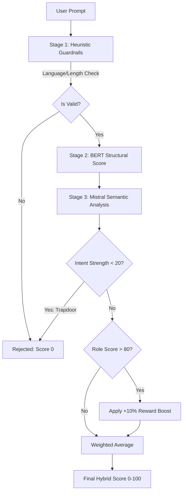
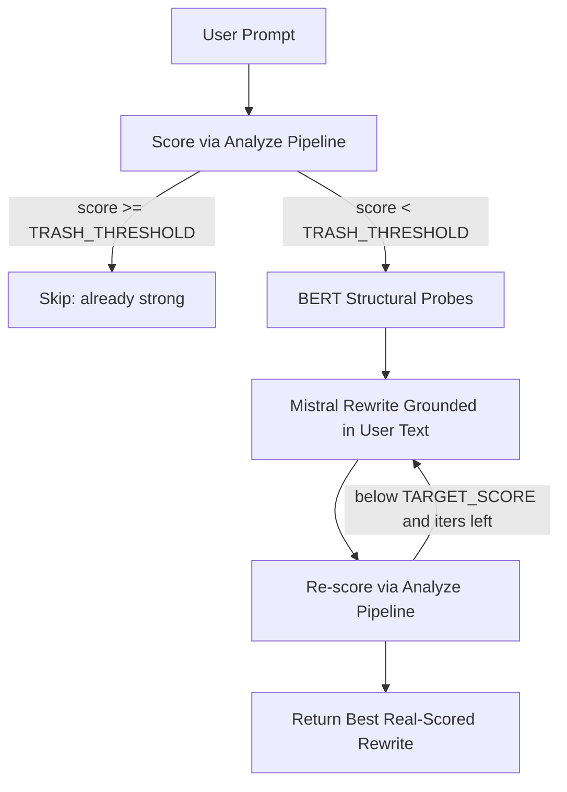

# Prompt Analyzer: A Hybrid Ensemble Approach

An Empirical Prompt Evaluation Process based on a Hybrid Ensemble of Machine Learning Approaches, with an optional **Improve Prompt** pipeline powered by Mistral.

### [](https://prompt-analyzer-omega.vercel.app/)

## 1. Introduction

As large Language Models (LLMs) have become central to modern workflows, prompt quality is critical — yet most evaluation is still subjective. The Prompt Analyzer provides automated empirical scoring on a **0–100** scale by combining structural (BERT) and semantic (LLM) signals. When a prompt scores below a configurable threshold, **Improve Prompt** rewrites it into a stronger instruction and re-scores it with the same pipeline (no fake scores).

---

## 2. Key Features

* **Empirical Scoring**: Weighted fusion of structural (BERT) and semantic (Mistral) analyses for a consistent 0–100 rating.
* **Resource Optimization**: Lightweight BERT gatekeeper for structural scoring before deeper LLM analysis.
* **Intent Verification**: Probabilistic intent checks reject non-instructional text (e.g. poems, pure content).
* **Improve Prompt**: Score-guided rewrite loop — BERT structural probes → Mistral rewrite → real re-score (threshold default **80**).
* **Env-based Config**: API URLs and secrets loaded from `.env` (never hardcode keys).
* **Colored Server Logs**: Production-style logging with timestamps, levels, and truncated prompts.
* **Data Balancing**: Mitigates "Mode Collapse" (the "Tower of 65" problem) via up-sampling in training notebooks.
* **Live Demo**: https://prompt-analyzer-omega.vercel.app/

---

## 3. System Architecture & Methodology

Defense-in-Depth: heuristics → BERT structure → LLM semantics → optional improve loop.

### Analyze Flow


```mermaid
graph TD
    A[User Prompt] --> B[Stage 1: Heuristic Guardrails]
    B -->|Language/Length Check| C{Is Valid?}
    C -->|No| R[Rejected: Score 0]
    C -->|Yes| D[Stage 2: BERT Structural Score]
    D --> F[Stage 3: Mistral Semantic Analysis]
    F --> G{Intent Strength < 20?}
    G -->|Yes: Trapdoor| R
    G -->|No| H{Role Score > 80?}
    H -->|Yes| I[Apply +10% Reward Boost]
    H -->|No| J[Weighted Average]
    I --> J
    J --> K[Final Hybrid Score 0-100]
```

### Improve Flow


```mermaid
graph TD
    U[User Prompt] --> S[Score via Analyze Pipeline]
    S -->|score >= TRASH_THRESHOLD| Skip[Skip: already strong]
    S -->|score < TRASH_THRESHOLD| P[BERT Structural Probes]
    P --> M[Mistral Rewrite Grounded in User Text]
    M --> RS[Re-score via Analyze Pipeline]
    RS -->|below TARGET_SCORE and iters left| M
    RS --> Best[Return Best Real-Scored Rewrite]
```

### Pipeline Stages

#### 1. Heuristic Guardrails
* Language detection (`langdetect`) — non-English rejected.
* Length / repetition spam checks.

#### 2. Structural Scoring (BERT)
* Fine-tuned BERT regressor for structure / coherence.
* Hosted via Hugging Face Spaces (`BERT_API_URL`).

#### 3. Semantic Scoring (Mistral API)
* Intent Strength + clarity / specificity / context / constraints / complexity / role.
* Trapdoor: Intent &lt; 20 → REJECTED.
* Hybrid weight: **30% BERT / 70% LLM**.

#### 4. Improve Prompt (optional)
* Triggered from the UI when the user clicks **IMPROVE PROMPT**, or when score is below `TRASH_THRESHOLD` (default **80**).
* Probes wrap the **raw user text** in structural shells (no hardcoded topic word lists).
* Mistral rewrites grounded in the user’s message; meta/instruction leaks are detected and retried.
* Final score always comes from a real `analyze_prompt_flow` pass — never forced to 100.

---

## 4. Mathematical Logic

### Hybrid Weighting

* **Intent Shift**: $30\%$ BERT / $70\%$ LLM — prioritizes utility and instruction quality over fluency alone.

---

## 5. Setup & Configuration

### Tech Stack
* **Scoring**: BERT (HF Space) + Mistral Chat Completions API
* **Backend**: Flask
* **Frontend**: HTML / CSS / JS (Chart.js)
* **Deployment**: Vercel + Hugging Face Spaces

### 1. Clone

```bash
git clone https://github.com/GenAI-Community-VITB/Prompt-Analyzer.git
cd Prompt-Analyzer
```

### 2. Install Dependencies

```bash
pip install -r requirements.txt
```

### 3. Configure Environment

Copy `.env.example` to `.env` and fill in values:

```bash
cp .env.example .env
```

| Variable | Purpose | Default |
|----------|---------|---------|
| `BERT_API_URL` | BERT scorer endpoint | — (required) |
| `MISTRAL_API_KEY` | Mistral API key for score + improve | — (required) |
| `MISTRAL_MODEL` | Chat model name | `mistral-small-latest` |
| `MISTRAL_API_URL` | Mistral API base | `https://api.mistral.ai/v1/chat/completions` |
| `TRASH_THRESHOLD` | Improve when score is below this | `80` |
| `TARGET_SCORE` | Stop improve loop early at this score | `90` |
| `MAX_IMPROVE_ITERS` | Max rewrite iterations | `3` |

**Never commit `.env`.** Rotate any key that was shared in chat or committed by mistake.

### 4. Run

```bash
python main.py
```

Open http://127.0.0.1:5000

### API Routes

| Method | Path | Description |
|--------|------|-------------|
| `GET` | `/` | Web UI |
| `POST` | `/analyze` | Score a prompt |
| `POST` | `/improve` | Rewrite + re-score |
| `GET` | `/logs` | Recent in-memory prompt events (server-side) |

---

## 6. File Structure

```text
Prompt-Analyzer/
├── static/                 # CSS / JS / assets
├── templates/              # Flask HTML
├── app_flow.py             # Analyze + improve orchestration
├── main.py                 # Flask routes
├── logging_config.py       # Colored production-style logging
├── prompt_log.py           # In-memory prompt event buffer
├── .env.example            # Env template (no secrets)
├── dataset_EDA.ipynb       # Data cleaning / Tower of 65 analysis
├── final_clean_bert_data.csv
├── model_train.ipynb       # BERT fine-tuning
├── requirements.txt
└── vercel.json
```

---

## 7. Project Contributors

* Aditya Mishra, Amritanshu Gupta, Abhinav Kumar, Ayush Mishra, Anuj Srivastava, Mineesha Ranjan Swain, Harshvardhan Om.
